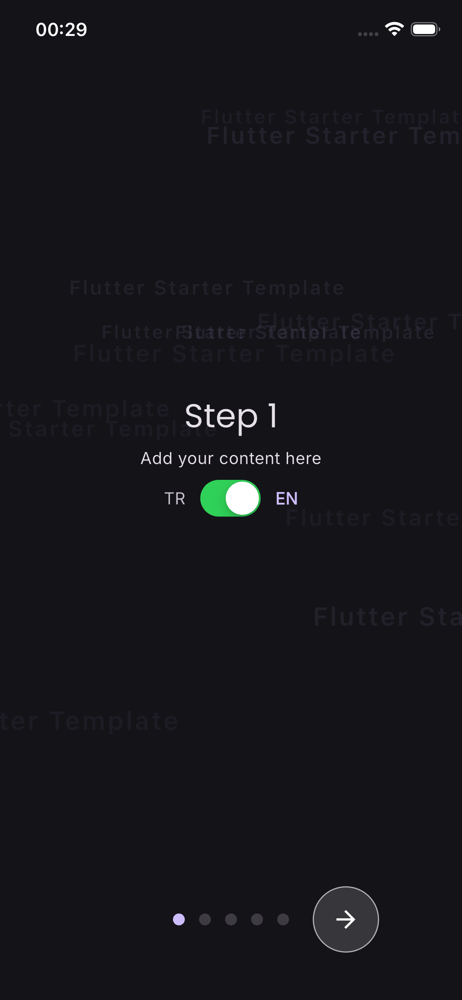
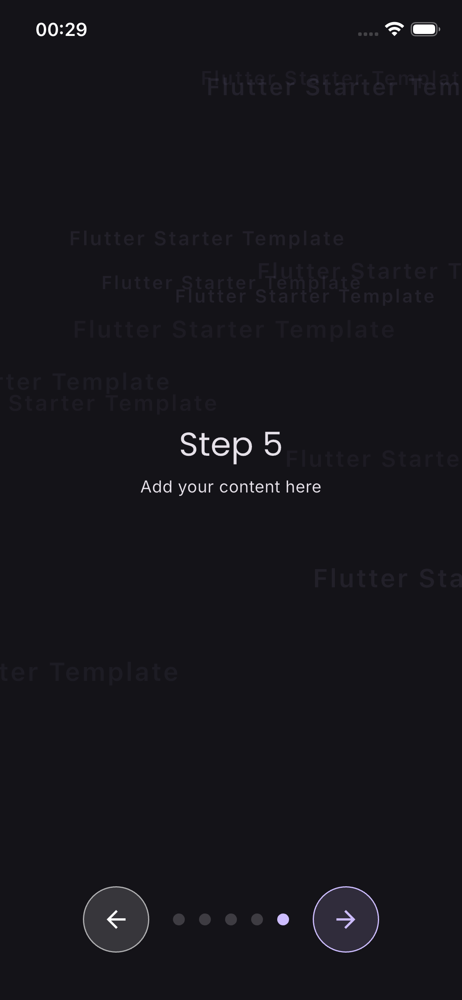
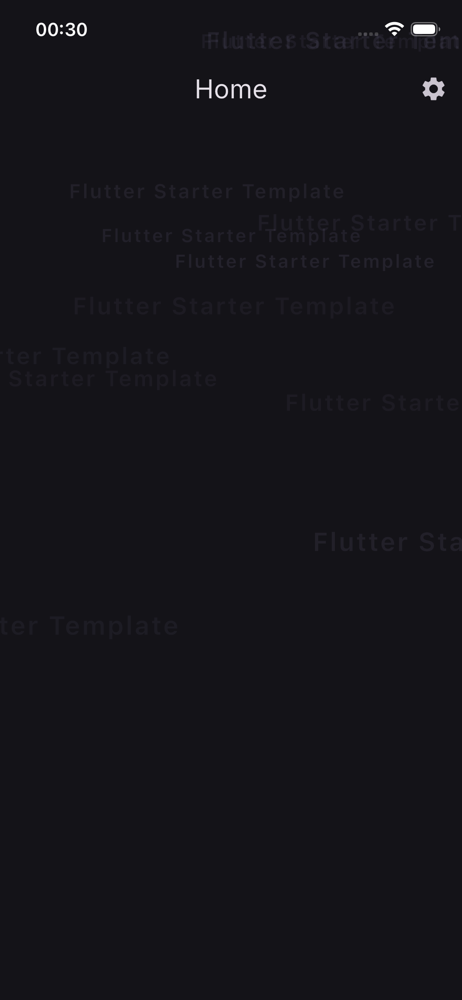
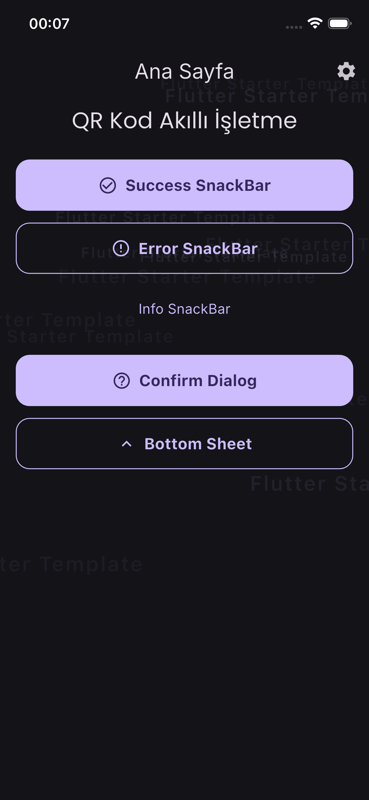
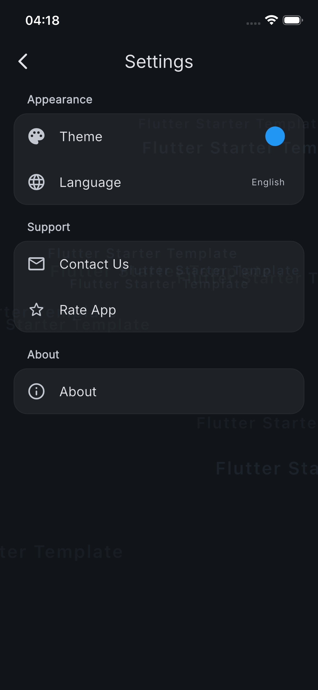
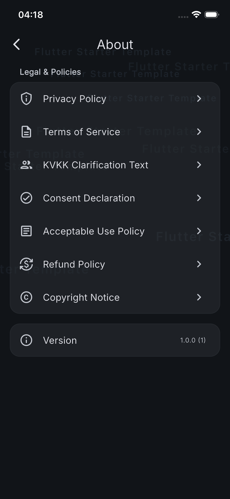
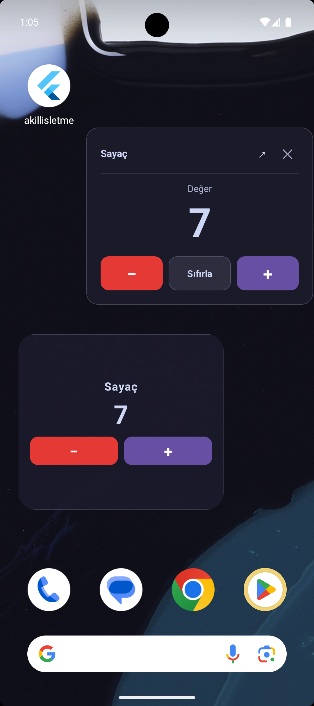

# Flutter Starter Template

A ready-to-use Flutter boilerplate for starting new projects without setting up architecture from scratch. Clone, configure, and start building features immediately.

## Screenshots

  
  
  
  
  
  
  

## Tech Stack

| Category | Package |
|---|---|
| State Management | flutter_bloc, freezed |
| DI | get_it |
| Routing | go_router, go_router_builder |
| Cache | hive_ce, shared_preferences |
| Localization | easy_localization |
| Code Generation | build_runner, flutter_gen_runner, freezed, json_serializable |
| UI | flutter_svg, lottie, shimmer, smooth_page_indicator |

## Getting Started

**Working with an AI agent?** Point it at **[`AGENTS.md`](doc/guides/AGENTS.md)** — the canonical instruction file that any AI tool (Claude, Cursor, Copilot, Codex…) reads to understand the project, conventions, and coding standards. `CLAUDE.md` and `.cursorrules` are thin pointers to it.

After cloning, see **[`doc/guides/project.md`](doc/guides/project.md)** — the main project guide. It covers everything you need to get started.

If this is a fresh clone, follow **[`doc/guides/setup_after_clone.md`](doc/guides/setup_after_clone.md)** first to clean generated files, install dependencies, and run code generation.

## Documentation

The `doc/` directory is the built-in knowledge base for this project. Start at **[`doc/guides/README.md`](doc/guides/README.md)** for the doc map and task→doc routing table. Instead of memorizing conventions, read the relevant file.

| File | What it covers |
|------|----------------|
| [`doc/guides/README.md`](doc/guides/README.md) | Doc map + task→doc table + new-feature checklist |
| [`doc/guides/project.md`](doc/guides/project.md) | Project overview, architecture, all built-in systems |
| [`doc/guides/clean_code.md`](doc/guides/clean_code.md) | Portable clean-code standard (applies to every line of code) |
| [`doc/`](doc/) | Ongoing dev task guides (feature, state, service, model, routing…) |
| [`doc/`](doc/) | Cloner: post-clone setup, customization, Firebase, native splash |
| [`doc/`](doc/) | Environment issues (emulator) |

## Credits

Some architectural patterns and utilities were referenced from [hatayi-yasat](https://github.com/VB-CORE/hatayi_yasat), a production Flutter project.

## License

Feel free to use this template for your own projects.
